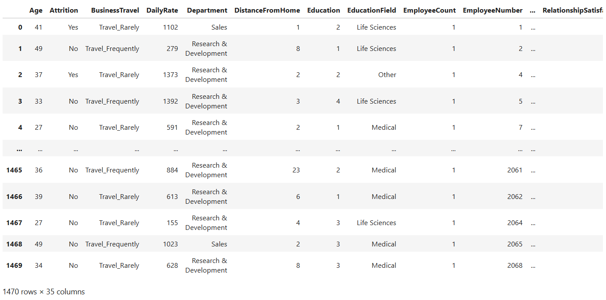
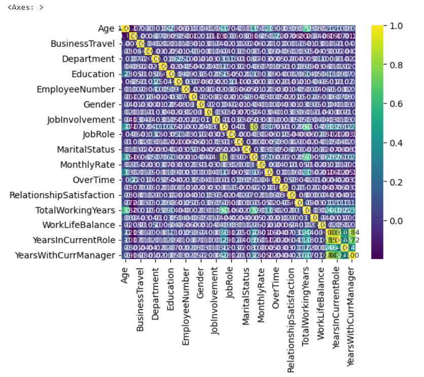
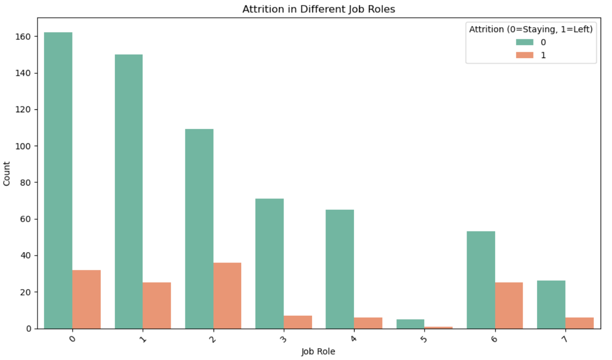
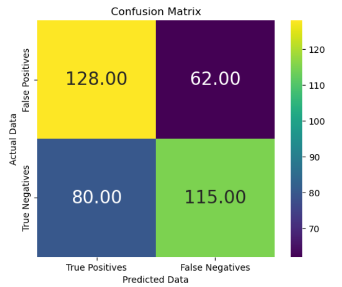
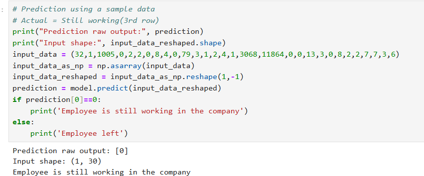

# Employee Attrition Prediction

## Objective
This project analyzes employee attrition using an end-to-end machine learning workflow. It focuses on understanding the key factors that influence employee turnover through exploratory data analysis (EDA), including box plots and correlation heatmaps. Data preprocessing techniques such as feature encoding and handling class imbalance using SMOTE were applied to prepare the dataset for modeling. Machine learning classification models were trained and evaluated using metrics like accuracy, precision, recall, and F1-score. The final model was used to predict employee attrition and identify important factors contributing to workforce trends, supporting data-driven decision-making.

### Skills Learned

- Conducted exploratory data analysis (EDA) to identify trends, patterns, and factors influencing employee attrition.
- Applied data preprocessing techniques including handling missing values, encoding categorical variables, feature scaling, and class imbalance correction using SMOTE.
- Built and trained a Logistic Regression model for employee attrition classification.
- Evaluated model performance using classification metrics such as accuracy, precision, recall, F1-score, and confusion matrix.

### Tools and Packages Used

- **Python** for data analysis, preprocessing, and model implementation.
- **NumPy** for numerical computations and feature transformations.
- **Pandas** for data cleaning, manipulation, and preparation.
- **Matplotlib** for visualizing distributions, trends, and box plots.
- **Seaborn** for correlation analysis and heatmap visualizations during EDA.
- **Scikit-learn** for building, training, and evaluating the Logistic Regression classification model.
- **Jupyter Notebook** for experimentation, analysis, and result documentation.

## Steps

### 1. Data Collection and Loading

The employee dataset was loaded using Pandas for analysis and machine learning modeling. An initial inspection was performed to understand the dataset’s structure, feature types, size, and basic statistical properties, helping identify potential data quality issues early in the process.

*Ref 1: Dataset Preview*

This step involved checking the first few rows, data types, and basic statistics to gain an overview of the dataset.

### 2. Exploratory Data Analysis (EDA)

EDA was conducted to gain insights into employee characteristics and attrition patterns. Visualizations such as box plots, count plots, and correlation heatmaps were used to examine feature distributions, detect outliers, and understand relationships between variables influencing attrition.

*Ref 2: EDA Visualizations*

Plots such as heatmaps, histograms, and scatter plots were used to analyze feature relationships and their impact on house prices.

*Ref 3: Graph showing Attrition Distribution by Job Role*

This visualization shows employee attrition across different job roles using a count plot. It highlights how attrition varies between roles by comparing the number of employees who stayed versus those who left, helping identify roles with higher turnover.

### 3. Data Preprocessing

The dataset was cleaned and prepared by handling missing values, encoding categorical variables, and applying feature scaling where required. To address class imbalance in the target variable, SMOTE was applied, ensuring the model learned patterns effectively from both classes.

### 4. Train-Test Split

The preprocessed data was split into training and testing sets to evaluate model performance on unseen data. This step helped prevent overfitting and ensured a reliable assessment of the model’s generalization capability.

### 5. Model Training

A Logistic Regression classification model was trained using the training dataset. The model learned relationships between input features and employee attrition outcomes, providing a simple yet effective baseline for classification.

### 6. Prediction and Evaluation

The trained model was used to predict employee attrition on the test dataset. Model performance was evaluated using metrics such as accuracy, precision, recall, F1-score, and a confusion matrix to assess prediction quality. The results were further analyzed to understand attrition trends and support data-driven workforce decisions.

*Ref 4: Confusion Matrix*

The confusion matrix visualizes the model’s classification performance by showing the number of correct and incorrect predictions for each class. It helps evaluate how well the model distinguishes between employees who stayed and those who left.

*Ref 5: Prediction Result*

### 7. Attrition Rate Calculation

The attrition rate of the company was calculated to understand the overall employee turnover. This metric represents the percentage of employees who left the organization during the observed period and provides a high-level view of workforce stability.

*Ref 6: Attrition Rate Calculation*

The calculation compares the number of employees who left the company with the total number of employees, helping quantify the scale of attrition and support further analysis and modeling.

